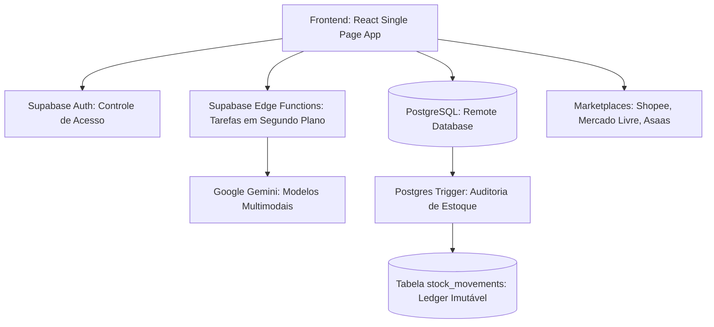
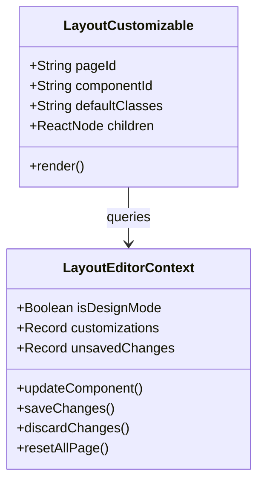

# 📚 Gest'Omni: Manual de Operação & Documentação do Sistema

Bem-vindo ao **Manual Oficial e Documentação do Gest'Omni**. Este documento foi elaborado para servir como o guia definitivo tanto para o lojista no dia a dia operacional quanto para você, como desenvolvedor, na manutenção e expansão da plataforma.

O Gest'Omni é um sistema de gestão comercial e financeira de nível empresarial, projetado especialmente para pequenos empresários e artesãos, trazendo ferramentas avançadas de inteligência artificial (IA), controle de estoque imutável, sincronização multi-canal (marketplaces) e personalização no-code.

---

## 🖼️ Visão Geral do Sistema


---

## 🛠️ Arquitetura Tecnológica e Relações de Dados

O Gest'Omni é construído sobre uma arquitetura moderna e reativa de alto desempenho:
* **Frontend**: React + TypeScript + Vite + Tailwind CSS + Shadcn/ui.
* **Backend & Servidor Serverless**: Supabase (PostgreSQL, Realtime DB, Auth e Edge Functions).
* **Inteligência Artificial**: Google Gemini API via gateway Supabase Edge Functions.



---

# 📖 Parte 1: Manual de Operações (Telas do Usuário)

Nesta seção, detalhamos o funcionamento de cada uma das principais telas do Gest'Omni e fornecemos instruções passo a passo para sua operação.

---

## 1. Painel de Controle (Dashboard)
A tela inicial fornece uma visão financeira e operacional do negócio em tempo real.

### Principais Recursos:
* **KPIs Consolidados**:
  * **Faturamento Bruto**: Soma total de vendas efetuadas e encomendas concluídas no período.
  * **Despesas Consolidadas**: Soma do CMV (Custo de Mercadorias Vendidas) + contas a pagar operacionais pagas + pagamentos a artesãs + custos de frete de entregadores.
  * **Lucro Líquido Real**: Faturamento menos despesas consolidadas, com exibição de margem líquida percentual.
  * **Estoque Ativo**: Total físico de itens na loja e quantidade de produtos abaixo do mínimo.
* **Gráfico de Área Financeiro**: Representação em linha suave das tendências de faturamento, gastos e lucros diários com tooltips dinâmicos e precisos ao passar o mouse.
* **Filtros de Período**: Seleção rápida de data (Hoje, Semana, Mês, Ano, Últimos 7 dias, Últimos 30 dias) com correção automática de fuso horário brasileiro (UTC-3).
* **Métricas Interativas**:
  * **Média Mensal & Última Atualização**: Dados automatizados.
  * **Meta de Vendas Editável**: Widget interativo que exibe a meta mensal, cálculo de porcentagem atingida e dicas automáticas baseadas em projeções diárias. Você pode clicar no **Lápis de Edição** ao lado da meta para alterá-la instantaneamente sem sair do widget!

### Como Usar:
1. Para analisar um período específico, use o menu suspenso de filtros no topo do painel. As métricas e o gráfico de área se reajustarão na hora.
2. Passe o mouse sobre os pontos do gráfico de área para inspecionar os valores exatos de receita, custos e rentabilidade do dia.
3. Para ajustar a meta do mês, clique no lápis do widget de performance, insira o novo valor de meta e confirme (clique no *check* verde). O progresso e as projeções diárias serão recalculados na hora.

---

## 2. Ponto de Venda (PDV - Vendas)
A tela de checkout rápido para vendas diretas ao cliente final na loja física.

### Principais Recursos:
* **Carrinho de Compras Ativo**: Adição de produtos por pesquisa inteligente ou scanner.
* **Variações de Produtos**: Seleção de variações de cor, tamanho ou modelo no carrinho.
* **Calculadora de Descontos**: Descontos em valor fixo (R$) ou percentual (%).
* **Cadastro de Clientes**: Associação rápida da venda a um cliente cadastrado para acompanhamento no CRM.
* **Múltiplos Meios de Pagamento**: Pix, Cartão de Crédito, Cartão de Débito, Dinheiro, e faturamento integrado.
* **Devoluções e Estornos**: Painel lateral contendo o histórico de vendas para estornar transações e retornar automaticamente as peças ao estoque.

### Como Usar:
1. Pesquise o produto pelo nome ou código de barras na barra de buscas. Selecione o produto e defina a variação (se houver).
2. Para associar um cliente, use a lupa de busca de clientes ao lado do carrinho.
3. Insira descontos se aplicável. Escolha a forma de pagamento e clique em **Finalizar Venda**.
4. O estoque do produto físico correspondente será decrementado instantaneamente e a venda será integrada ao fluxo financeiro no Dashboard.

---

## 3. Gestão de Estoque & Catálogo
A central de cadastro de mercadorias, controle de perdas e importação inteligente.

### Principais Recursos:
* **Catálogo Geral**: Grade de produtos ativos com fotos, marcas, quantidade física, custo unitário e preço de revenda.
* **Aba "Em Revisão"**: Área dedicada para produtos importados via nota fiscal que ainda necessitam de validação ou precificação do proprietário antes de ficarem visíveis para vendas.
* **Importador DANFE por Inteligência Artificial**: Envio de arquivos XML ou PDFs de notas fiscais de fornecedores. O sistema converte o PDF em Base64 e aciona a IA Gemini-2.0-flash para decodificar todos os produtos, quantidades e preços de custo da nota automaticamente.
* **Precificação Científica**: Aplicação de markup com margens ideais baseadas em custos operacionais (`Preço = Custo / 0.55`).
* **Variações Avançadas**: Gestão de grades complexas de produtos dentro do próprio cadastro (tamanhos, cores, SKUs e estoques específicos).

### Como Usar:
1. **Cadastro Manual**: Clique em **Novo Produto**, preencha os dados de nome, custo, venda (use a calculadora de markup se precisar) e variações.
2. **Importação via IA (DANFE/XML)**:
   * Clique em **Importar XML**.
   * Arraste a nota em XML ou o PDF do DANFE (máximo 4.5MB).
   * O Gemini lerá o documento e exibirá uma listagem de todos os produtos extraídos.
   * Ao aprovar a importação, os produtos novos serão criados na aba **"Em Revisão"** como rascunhos com preços sugeridos por markup. Os produtos que já existiam no estoque terão suas quantidades somadas automaticamente.
   * Acesse a aba **"Em Revisão"**, clique em **Revisar e Publicar** no produto desejado, selecione sua categoria definitiva, confirme os valores e clique em publicar.

---

## 4. Histórico de Auditoria (Ledger)
Um livro-razão imutável de todas as movimentações físicas de estoque do Gest'Omni.

### Principais Recursos:
* **Gatilho a Nível de Banco de Dados**: Qualquer alteração efetuada nas colunas de quantidade de produtos ou no array JSONB de variações aciona um trigger PostgreSQL imutável.
* **Registro de Transação Detalhado**: Loga a data exata, a variação modificada, a quantidade alterada (ex: `+10` ou `-2`), o motivo da movimentação (Venda Física, Entrada de NF-e, Ajuste Manual de Inventário, Devolução) e o e-mail do operador responsável.
* **Filtros por Período e Motivo**: Permite auditar rapidamente desvios e verificar quando o estoque foi movimentado.

### Como Usar:
1. Vá até a aba **Estoque** e selecione a aba **Auditoria**.
2. A lista de auditoria exibirá de forma cronológica decrescente todas as movimentações.
3. Utilize os filtros de data e tipo de movimentação no topo da aba para auditar auditorias ou apurar perdas de produtos.

---

## 5. Dashboard Financeiro & Fluxo de Caixa
O cérebro financeiro do Gest'Omni para controle de saúde corporativa.

### Principais Recursos:
* **DRE Simplificado (DRE Real)**: Exibe Faturamento Bruto, Dedução de Custos de Aquisição (CMV), Custos Fixos Operacionais, Taxas Financeiras e Lucro Líquido Consolidado.
* **Controle de Transações**: Lista completa de entradas e saídas financeiras da empresa.
* **Categorias Personalizáveis**: Central para gerenciar categorias de despesas (Ex: Aluguel, Prolabore, Marketing, Energia).
* **Controle de Contas a Pagar**: Integração de faturas a vencer com lembretes automáticos no Dashboard e barra de notificações do cabeçalho.

### Como Usar:
1. Para inserir uma despesa manual (ex: compra de fitas decorativas ou pagamento de internet), clique em **Nova Transação**, selecione o tipo *Despesa*, preencha o valor, a categoria e a data de pagamento.
2. No menu **Financeiro** -> **Contas a Pagar**, cadastre os boletos futuros. Ao efetuar o pagamento do boleto, clique em *Dar Baixa*. O sistema migrará a fatura automaticamente para a tabela de despesas pagas e reajustará o DRE do mês.

---

## 6. Encomendas sob Medida
Controle de produção para armarinhos e ateliês que trabalham com encomendas.

### Principais Recursos:
* **Fases de Produção**: Acompanhamento visual dos pedidos (Aguardando Sinal, Em Produção, Pronto para Entrega, Entregue).
* **Histórico de Pagamento de Sinais**: Registro de adiantamentos e saldo pendente a receber no ato da entrega.
* **Prazos de Entrega**: Indicadores de proximidade de prazo com alertas visuais.

### Como Usar:
1. Clique em **Nova Encomenda**, selecione o cliente, descreva os detalhes da personalização (cores, fios, medidas), insira o valor total e o valor de sinal pago.
2. Conforme o ateliê avança na produção, atualize o status da encomenda na tela. Ao finalizar, o cliente é notificado (via integração com WhatsApp) e a entrega pode ser efetuada.

---

## 7. Parceiras (Artesãs)
Controle de parcerias com artesãs e cooperativas de produção terceirizada.

### Principais Recursos:
* **Débito de Matéria-Prima**: Registro de insumos e novelos retirados pelas artesãs para produção.
* **Créditos de Produção**: Registro dos valores que a artesã tem a receber pelas peças prontas entregues.
* **Saldo a Pagar/Receber**: Balanço financeiro individualizado de cada parceira.

### Como Usar:
1. Cadastre a artesã em **Parceiros** -> **Parceiras**.
2. Ao liberar fios ou linhas para ela trabalhar, registre a retirada de insumos (o sistema debita do seu estoque e lança na conta corrente dela).
3. Ao receber as peças prontas, registre a entrada de produtos no estoque e o crédito correspondente a ser pago à artesã. O sistema calcula a diferença financeira líquida automaticamente.

---

## 8. Integração de Marketplaces
Sincronização de estoque e pedidos com grandes plataformas de e-commerce.

### Principais Recursos:
* **Sincronização Bidirecional**: Sincroniza estoques físicos da loja com anúncios na Shopee e Mercado Livre.
* **Vinculação de Produtos**: Associa o anúncio do marketplace ao ID do produto correspondente no estoque físico do Gest'Omni.
* **Logs de Sincronia**: Histórico de atualizações de estoque para rastreamento de conciliação.

### Como Usar:
1. Acesse o menu **Marketplaces**. Clique em **Conectar** e siga o fluxo de autenticação OAuth da plataforma desejada (Shopee/Mercado Livre).
2. Uma vez conectado, vá em **Produtos Vinculados** e associe os SKUs virtuais ao produto pai físico correspondente.
3. Sempre que uma venda for efetuada no PDV físico ou no e-commerce integrado, o estoque remanescente será propagado e atualizado na Shopee/Mercado Livre em poucos segundos.

---

## 9. Pedidos Online & Loja Pública
A vitrine virtual integrada e o painel de entrega do e-commerce da sua loja.


### Principais Recursos:
* **Loja Online Pública**: Site de compras para seus clientes finais selecionarem produtos diretamente do seu catálogo de ativos, calculando frete por distância (Google Maps API) e finalizando a compra.
* **Painel de Despacho de Pedidos**: Área administrativa que exibe os pedidos recebidos da loja pública.
* **Integração Financeira**: Ao clicar em **Confirmar Entrega**, o sistema deduz os insumos do estoque físico, insere o recebível na folha de vendas diária e abate o custo pago ao motoboy/entregador, calculando o saldo de frete líquido do negócio.
* **Disparo de Mensagens de WhatsApp**: Botão rápido com mensagem pré-preenchida contendo os dados do pedido para enviar ao cliente via WhatsApp.

### Como Usar:
1. Divulgue o link da sua loja online em suas redes sociais.
2. Ao receber um pedido, você receberá alertas visuais e sonoros no cabeçalho. Acesse **Pedidos Online** -> **Loja Própria**.
3. O pedido constará como *Aguardando*. Verifique o pagamento e clique em **Confirmar Pagamento** para migrar o pedido para *Confirmado*.
4. Ao despachar o entregador, quando o pedido for entregue, clique em **Confirmar Entrega**, insira o valor real pago ao entregador de frete. A transação será integrada ao DRE financeiro automaticamente e o saldo de estoque deduzido de forma limpa.

---

# 💻 Parte 2: Manual do Desenvolvedor (Controles Técnicos)

Esta seção documenta os módulos e ferramentas exclusivas criadas para facilitar o desenvolvimento, diagnóstico e customizações avançadas no Gest'Omni.

---

## 1. Painel do Desenvolvedor
A tela `/admin-desenvolvedor` fornece ferramentas para depuração e testes rápidos do ecossistema.

### Principais Recursos:
* **Bypass de Autenticação**: Atalhos para alternar rapidamente entre o perfil de Proprietário (*Owner*), Funcionário (*Employee*) ou Administrador Geral de forma simulada sem precisar deslogar.
* **Monitor de Conectividade do Banco**: Exibe latência de requisições à API do Supabase e status de canais Realtime de escuta do Postgres.
* **Logs de Sistema**: Painel de depuração em tempo real capturando exceções e respostas de requisições HTTP para integrações externas.

---

## 2. GestOmni DevStudio (Editor Visual de Layout)
A ferramenta visual no-code que permite reorganizar a tela do aplicativo sem precisar modificar o código-fonte manualmente.



### Como Operar o DevStudio (Passo a Passo):
1. **Ativar o Modo Design**:
   * Estando logado com um e-mail de desenvolvedor (ex: `rodrigosantosteste@gmail.com`), clique no **botão de Lápis flutuante** no canto inferior direito.
   * O sistema entrará em Modo Design: todos os cartões e gráficos do Dashboard e Pedidos Online exibirão bordas azuis pontilhadas com tags flutuantes como `#kpi-faturamento` ou `#chart-vendas`.
2. **Customizar um Widget**:
   * Passe o mouse sobre o elemento pontilhado e clique no botão de **Engrenagem** que aparece no topo direito do widget.
   * Um painel suspenso de configurações se abrirá. Nele, você pode alterar:
     * **Largura Desktop (Colunas Grid)**: Redefine quantas colunas o widget ocupa no grid CSS do monitor.
     * **Largura Mobile**: Modifica o tamanho do elemento em smartphones (1 ou 2 colunas).
     * **Ordem (Flex Order)**: Clique em *Subir* ou *Descer* para mover fisicamente o widget para frente ou para trás na tela.
     * **Estilos (Padding, Bordas, Sombras, Visibilidade)**: Altere o preenchimento interno, o arredondamento de cantos, a elevação de sombras ou oculte o widget da tela de forma permanente.
3. **Persistir as Alterações**:
   * As alterações aplicadas atualizam o DOM instantaneamente para pré-visualização ao vivo (*Live Preview*).
   * Para salvar definitivamente as alterações no banco de dados Supabase para que fiquem ativas em todos os dispositivos, clique no botão **Salvar Layout** na barra suspensa inferior de ferramentas.
   * Se quiser desfazer tudo, clique em **Descartar** para apagar o cache local, ou clique em **Resetar Página** para excluir os registros do banco de dados e restaurar o visual original padrão.

---

## 🔒 Segurança de Acesso e RLS (Row Level Security)

Para proteger a integridade do layout do sistema, as alterações visuais são rigorosamente restritas no PostgreSQL do Supabase:
```sql
-- Apenas usuários cadastrados como desenvolvedores podem gravar dados no layout
CREATE POLICY "Allow write for admins" ON public.layout_customizations
    FOR ALL TO authenticated
    USING (
        auth.jwt()->>'email' IN ('rodrigosantoscandidodasilva@gmail.com', 'rodrigosantosteste@gmail.com')
        OR EXISTS (SELECT 1 FROM public.user_roles WHERE user_roles.user_id = auth.uid() AND user_roles.role = 'admin')
    );
```

---

## ⚠️ Resolução de Problemas Comuns (FAQ do Desenvolvedor)

### 1. Desvio de Horário / Timezone nas Vendas Diárias
* **Sintoma**: Vendas feitas no final da noite (ex: 23:30) aparecem no Dashboard do dia seguinte.
* **Causa**: Supabase e Postgres salvam dados no formato UTC. A comparação direta de datas no fuso horário do servidor desloca as vendas em 3 horas para a frente no fuso brasileiro de Brasília (UTC-3).
* **Solução**: Usar a função de normalização local `getLocalMidnightISO` em [Index.tsx](file:///c:/Users/Rodrigo/Documents/Aemarinho/src/pages/Index.tsx) que zera as horas no fuso local antes de efetuar a conversão ISO do limite de consulta para o banco de dados.

### 2. Erros de Estouro de Memória no Envio de PDFs de Notas Fiscais
* **Sintoma**: DANFE muito grande (ex: arquivo de 10MB compilado mensalmente) derruba o Edge Function ou gera erro HTTP 413 (Payload Too Large).
* **Causa**: Limites estritos de tamanho de corpo de requisição em microsserviços serverless Deno e tempos limite de CPU.
* **Solução**: Implementamos uma validação local no componente [ExpressImportDialog.tsx](file:///c:/Users/Rodrigo/Documents/Aemarinho/src/components/stock/ExpressImportDialog.tsx) limitando uploads para no máximo 4.5MB por operação, fornecendo avisos educativos ao lojista para fazer upload de arquivos individualizados ao invés de compilações mensais unificadas.
