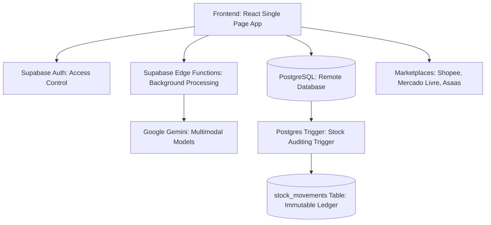
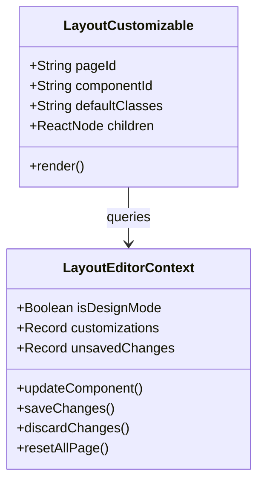

# 📚 Gest'Omni: Operation Manual & System Documentation

Welcome to the **Official Gest'Omni Manual and System Documentation**. This document has been prepared to serve as the definitive guide for both shop owners in their day-to-day operations and you, as a developer, in maintaining and expanding the platform.

Gest'Omni is an enterprise-grade retail and financial management system designed specifically for small business owners and artisans, bringing advanced artificial intelligence (AI) features, immutable stock auditing, multi-channel marketplace synchronization, and no-code layout customization.

---

## 🖼️ System Overview


---

## 🛠️ Technological Architecture and Data Flow

Gest'Omni is built on a modern, reactive, high-performance architecture:
* **Frontend**: React + TypeScript + Vite + Tailwind CSS + Shadcn/ui.
* **Backend & Serverless Layer**: Supabase (PostgreSQL, Realtime DB, Auth, and Edge Functions).
* **Artificial Intelligence**: Google Gemini API via Supabase Edge Functions gateway.



---

# 📖 Part 1: Operations Manual (User Pages)

In this section, we break down how each major page in Gest'Omni functions and provide step-by-step instructions for standard operations.

---

## 1. Control Panel (Dashboard)
The home screen provides a consolidated real-time overview of the business's financial and operational health.

### Key Features:
* **Consolidated KPIs**:
  * **Gross Revenue**: Sum total of all completed sales and customized orders in the selected period.
  * **Consolidated Expenses**: Sum of CMV (Cost of Goods Sold) + paid operational accounts payable + artisan production payments + delivery rider shipping costs.
  * **Real Net Profit**: Gross revenue minus consolidated expenses, featuring a clean liquid profit percentage indicator.
  * **Active Inventory**: Total physical quantity of items in the store and a count of products currently below their minimum threshold.
* **Financial Area Chart**: Smooth line representation of daily revenue, expenses, and profits with dynamic, precise tooltips on hover.
* **Date Range Filters**: Quick date filters (Today, Week, Month, Year, Last 7 Days, Last 30 Days) with automatic Brazilian timezone alignment (UTC-3).
* **Interactive Goal Widget**:
  * **Monthly Sales Goal**: Displays the current goal, percentage achieved, and daily progress tips. You can click on the **Pencil Edit Icon** next to the goal to adjust it instantly!

### How to Use:
1. To analyze a specific period, use the dropdown filter menu at the top. The KPIs and area chart will adjust instantly.
2. Hover over any node in the area chart to inspect exact values of revenue, costs, and profit for that specific day.
3. To adjust the monthly sales target, click the pencil inside the performance widget, enter the new value, and click the green checkmark to confirm.

---

## 2. Point of Sale (POS - Checkout Vendas)
A fast checkout screen for direct, over-the-counter retail sales.

### Key Features:
* **Active Shopping Cart**: Add products using an intelligent search bar or barcode scanner.
* **Product Variations**: Select sizes, colors, or specific models directly in the checkout cart.
* **Discount Calculator**: Apply fixed-value discount (R$) or percentage discount (%).
* **Customer Association**: Link sales to registered clients to track customer profiles in the CRM.
* **Multiple Payment Methods**: Pix, Credit Card, Debit Card, Cash, and integrated financing accounts.
* **Returns & Refunds Panel**: Access a side drawer containing the recent sales history to refund transactions, which automatically returns the items to the physical inventory.

### How to Use:
1. Search for a product by name or scan its barcode. Add it to the cart and specify variations if applicable.
2. To link a client, click the search icon next to the cart and select their profile.
3. Apply any discounts, select the payment method, and click **Finalize Sale**.
4. Stock quantities are decremented instantly, and transactions are pushed directly into the financial ledger.

---

## 3. Inventory & Catalog Management
The central dashboard to register merchandise, track wastage, and import invoice files.

### Key Features:
* **General Catalog**: A grid of active products showcasing photos, brands, physical stock levels, unit costs, and retail prices.
* **"Under Review" Tab**: A dedicated staging area for products imported from invoices that require review and markup confirmation by the store owner before becoming active.
* **AI-Powered Invoice Parser**: Drag-and-drop XML or PDF DANFE documents. The system converts PDFs to Base64 and triggers the multimodal Gemini-2.0-flash model to automatically extract supplier names, invoice numbers, products, quantities, and unit costs.
* **Scientific Pricing**: Suggests optimal retail prices based on operating expenses and markups (`Price = Cost / 0.55`).
* **Advanced Variations**: Manage product grades (sizes, colors, custom SKUs) directly within a single product profile.

### How to Use:
1. **Manual Entry**: Click **New Product**, fill in details (name, cost, selling price), and configure variations if any.
2. **AI Invoice Import (DANFE/XML)**:
   * Click **Import XML**.
   * Upload an XML or PDF invoice file (maximum size 4.5MB).
   * Gemini will process the document and show a structured review list.
   * On confirmation, existing items are summed to active inventory. New items are safely created under the **"Under Review"** tab as drafts.
   * Navigate to the **"Under Review"** tab, click **Review and Publish**, assign their final category, confirm pricing, and publish.

---

## 4. Audit History Ledger
An immutable, secure ledger of all physical stock movements within the application.

### Key Features:
* **Database-Level Trigger**: Any insert or update on the `products.quantity` column or the `variations` JSONB array triggers a secure, system-wide PostgreSQL log function.
* **Detailed Transaction Log**: Records dates, specific variations, change deltas (e.g. `+10` or `-3`), transaction reasons (POS Sale, Invoice Import, Manual Audit, Return), and operator e-mails.
* **Audit Filters**: Filter records by dates or movement reasons to quickly locate discrepancies.

### How to Use:
1. Navigate to the **Inventory** page and open the **Auditoria** (Audit) tab.
2. View stock history sorted chronologically (newest first).
3. Use the filter bars at the top to isolate specific dates or reason types to audit inventory losses or track sales-related deductions.

---

## 5. Financial Dashboard & Cash Flow
The core financial analytics tool for monitoring corporate business health.

### Key Features:
* **Consolidated DRE**: Simplifies reports, displaying Gross Revenue, CMV (Cost of Goods Sold deductions), Fixed Operating Expenses, Bank/Pix Fees, and Net Operating Income.
* **Transaction Ledger**: Complete income and expense register.
* **Custom Categories**: Define categories for operational costs (e.g. Rent, Payroll, Marketing, Electricity).
* **Accounts Payable Integration**: Log future fixed bills and track upcoming due dates in the main dashboard notification header.

### How to Use:
1. To record a manual expense (e.g. purchasing packaging materials or paying internet bills), click **New Transaction**, select *Expense*, choose a category, fill in the amount, and save.
2. In the **Finance** -> **Accounts Payable** tab, register future bills. Once paid, click *Mark as Paid* to migrate them to expenses and adjust the monthly DRE automatically.

---

## 6. Custom Orders (Encomendas)
Order production tracking for tailors, artisans, and custom-order ateliers.

### Key Features:
* **Production Board**: Drag and track order stages (Awaiting Deposit, In Production, Ready for Collection, Delivered).
* **Deposit Logs**: Track down-payments and remaining balances due on delivery.
* **Due Date Alerts**: Visual color-coded alerts for approaching deadlines.

### How to Use:
1. Click **New Order**, select a customer, define order details (dimensions, colors, instructions), enter the total price, and register the deposit paid.
2. Advance order stages as production progresses. Click the WhatsApp button once completed to notify the client and arrange delivery.

---

## 7. Artisans & Partners (Parceiras)
Management accounting for outsourced production partners and home artisans.

### Key Features:
* **Raw Material Debits**: Track raw materials and yarn rolls handed over to artisans for assembly.
* **Production Credits**: Record the value owed to the artisan once finished products are returned.
* **Balance Balancer**: Automatically calculate the net financial balance of each partner.

### How to Use:
1. Register partners in **Partners** -> **Artisans**.
2. When releasing raw materials to an artisan, register the item release (stock will decrement and be debited to their account balance).
3. Upon receiving finished items, register product entries (stock increments, and a production credit is applied to the partner's account). The system calculates the net payable balance automatically.

---

## 8. Marketplace Integration
Synchronize stock levels and sales across major e-commerce platforms.

### Key Features:
* **Bi-directional Sync**: Link store inventories to virtual listings on Shopee and Mercado Livre.
* **Product Mapping**: Map online listing SKUs to physical store product IDs.
* **Sync History Logs**: View recent stock propagation logs to verify sync status.

### How to Use:
1. Go to the **Marketplaces** tab. Click **Connect** and complete the OAuth authorization on the platform (Shopee/Mercado Livre).
2. Go to **Linked Products** and map the online listing SKUs to the physical store items.
3. Product sales on the physical POS or online store will trigger updates, propagating new inventory levels to Shopee/Mercado Livre in seconds.

---

## 9. Online Orders & Public Storefront
Your integrated public e-commerce store and local delivery dispatch desk.


### Key Features:
* **Public Webstore**: A clean storefront for clients to select products, calculate distance-based shipping fees (Google Maps API), and place orders.
* **Dispatch Control Desk**: Manage received storefront orders.
* **Financial Integration**: Confirming dispatch deducts inventory, registers sales, and deducts courier costs, balancing shipping fees in the DRE.
* **WhatsApp Dispatcher**: Pre-formats invoice and address details to send to the client via WhatsApp in one click.

### How to Use:
1. Distribute your store link. Upon receiving an order, sound alerts trigger in the header.
2. Go to **Online Orders** -> **Loja Própria** (Own Store).
3. Click **Confirm Payment** once Pix is verified to transition the status from *Awaiting* to *Confirmed*.
4. Once delivered, click **Confirm Delivery** and input the courier cost to register the sale, deduct inventory, and balance delivery costs.

---

# 💻 Part 2: Developer's Manual (Technical Controls)

This section documents the underlying modules, security measures, and custom developer tools built into Gest'Omni.

---

## 1. Developer Panel
The `/admin-desenvolvedor` route provides vital tools for testing and real-time environment diagnostics.

### Key Features:
* **Authentication Bypass**: Instantly swap active roles (Owner, Employee, Admin) to test permissions without logging out.
* **Database Ping Monitor**: Real-time Supabase connection latency checker and WebSocket listener status.
* **System Log Panel**: Live capture of HTTP exceptions and integrations payloads.

---

## 2. GestOmni DevStudio (Visual Layout Editor)
A no-code styling engine that allows developers to rearrange components directly on the UI without modifying source code files.



### Operating DevStudio (Step-by-Step):
1. **Activate Design Mode**:
   * Logging in with a developer e-mail (e.g. `rodrigosantosteste@gmail.com`) exposes a floating **Pencil Button** at the bottom right.
   * Clicking the button activates **Design Mode**. Widgets on the Dashboard and Pedidos Online display dashed indigo borders with tags (e.g. `#chart-vendas`).
2. **Customize a Widget**:
   * Hover over the dashed container and click the **Gear Icon** in the top right.
   * The customization panel will open, allowing you to configure:
     * **Desktop Width (Grid Columns)**: Change card width in the CSS grid (1 to 12 columns).
     * **Mobile Width**: Toggle sizing on mobile devices (1 or 2 columns).
     * **Flex Order**: Click *Move Up* or *Move Down* to change rendering positions.
     * **Styling Options**: Modify paddings, border roundedness, shadows, or toggle visibility.
3. **Persist the Layout**:
   * Adjustments reflect instantly on the UI.
   * To save changes permanently for all devices, click **Save Layout** on the bottom control bar.
   * To revert local drafts, click **Discard**. To clear database entries and restore original code layouts, click **Reset Page**.

---

## 🔒 Access Security and RLS (Row Level Security)

To protect layout integrity, database write operations are restricted in PostgreSQL:
```sql
-- Allow write operations only for registered developer admins
CREATE POLICY "Allow write for admins" ON public.layout_customizations
    FOR ALL TO authenticated
    USING (
        auth.jwt()->>'email' IN ('rodrigosantoscandidodasilva@gmail.com', 'rodrigosantosteste@gmail.com')
        OR EXISTS (SELECT 1 FROM public.user_roles WHERE user_roles.user_id = auth.uid() AND user_roles.role = 'admin')
    );
```

---

## ⚠️ Troubleshooting & FAQ

### 1. Late-Night Sales Timezone Shift
* **Symptom**: Sales recorded late at night (e.g. 23:30) appear on the next day's dashboard.
* **Cause**: Supabase stores timestamps in UTC. Direct day-splitting on UTC shifts Brasília's timezone (UTC-3) forward by 3 hours.
* **Solution**: Implemented `getLocalMidnightISO` in [Index.tsx](file:///c:/Users/Rodrigo/Documents/Aemarinho/src/pages/Index.tsx) to align boundaries with local midnight before converting to ISO query strings.

### 2. PDF Upload Crashes (DANFE Import)
* **Symptom**: Massive compiled monthly invoice PDFs generate HTTP 413 or crash the Edge Function.
* **Cause**: Serverless Deno CPU timeouts and request size limits.
* **Solution**: Validations inside [ExpressImportDialog.tsx](file:///c:/Users/Rodrigo/Documents/Aemarinho/src/components/stock/ExpressImportDialog.tsx) throttle uploads above 4.5MB, displaying advisory guidelines to upload individual invoices rather than monthly compilations.
